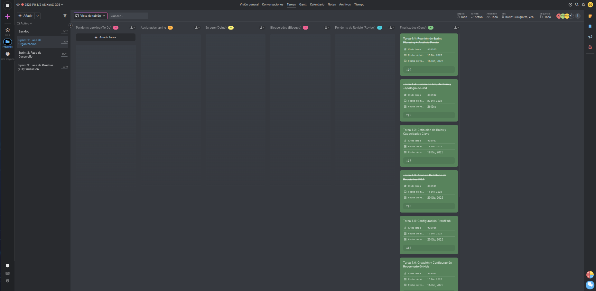

# Acta de Reunión - Sprint Review

## Información del Sprint

**Sprint:**
- Código / Nombre del sprint: Sprint 1 - Fase de Organización
- Fechas del sprint: 15/12/2025 - 27/01/2026

---

**Datos de la Reunión:**
- Fecha: 19/01/2026 15:00
- Reunión: Sprint Review
- Asistentes:
  - Erick García Badaraco
  - Francisco Díaz Encalada
  - Adrià Montero Sánchez

---

## Objetivo del Sprint

| Tema | Notes | Propietario | Estado | Última actualización |
|------|-------|-------------|--------|---------------------|
| **Tarea 1.1:** Reunión de Sprint Planning + Análisis Previo | Primera reunión de equipo para entender el proyecto, riesgos y dependencias. Se define el objetivo de Sprint 1: tener diagrama de arquitectura clara, justificación de tecnologías y MVP funcional. | Francisco Díaz Erick García Adrià Montero | **Terminada** | 19/01/2026 |
| **Tarea 1.2:** Definición de Roles y Capacidades Clave | Alineamiento de equipo: 8 capacidades clave, distribución de roles, conocimiento compartido y plan de pair programming. | Francisco Díaz Erick García Adrià Montero | **Terminada** | 12/01/2026 |
| **Tarea 1.3:** Análisis Detallado de Requisitos P0.1 | Extraer exhaustivamente requisitos funcionales y no-funcionales, cruzar con rúbrica para asegurar cobertura total. | Francisco Díaz Erick García Adrià Montero | **Terminada** | 12/01/2026 |
| **Tarea 1.4:** Diseño de Arquitectura y Topología de Red | Crear diagrama comprensivo de arquitectura S1-S7, documentando flujos de datos, puertos, protocolos y puntos críticos. | Erick García Adrià Montero | **Terminada** | 26/01/2026 |
| **Tarea 1.5:** Configuración ProofHub | Setup de herramienta central: 3 sprints, dashboard, tareas con fechas y responsables. | Francisco Díaz Erick García Adrià Montero | **Terminada** | 12/01/2026 |
| **Tarea 1.6:** Creación y Configuración Repositorio GitHub | Crear repositorio con estructura profesional, autenticación SSH, procedimientos control versiones. | Francisco Díaz Erick García | **Terminada** | 12/01/2026 |
| **Tarea 1.7:** Protocolo de Reuniones y Actas | Definir protocolo: Sprint Planning, Sprint Review. Actas + capturas ProofHub. | Francisco Díaz Erick García Adrià Montero | **Terminada** | 12/01/2026 |
| **Tarea 1.8:** Árbol de Documentación Markdown | Crear estructura comprensiva: README, ARQUITECTURA, INSTALACION, CONFIGURACION, etc. | Francisco Díaz Erick García Adrià Montero | **Terminada** | 12/01/2026 |
| **Tarea 1.9:** Definición del Esquema de Base de Datos | Diseñar esquema completo incluyendo metadatos de imágenes para evoluciones futuras. | Francisco Díaz | **Terminada** | 19/01/2026 |

---

## Feedback del Docente

### Comentarios positivos:

- El formato del acta fue aceptado y se usará en el resto del proyecto.

---

### Mejoras propuesadas:

- Escribir el título de cada tarea, además de su nombre.

---

### Captura de pantalla del ProofHub:

  

---

## Acciones Pendientes

_[Espacio para acciones pendientes del Sprint 1 - Normalmente ninguna, todas completadas]_

---

## Resumen Ejecutivo

**Progreso general del Sprint 1:** 100% completado (9 de 9 tareas principales terminadas) ✅

**Duración total del Sprint:** 43 días (15/12/2025 - 27/01/2026)

### Tareas completadas:

**Tarea 1.1:** Reunión de planificación y análisis previo del proyecto  
**Tarea 1.2:** Definición de roles, responsabilidades y capacidades clave del equipo  
**Tarea 1.3:** Análisis exhaustivo de requisitos funcionales y no-funcionales  
**Tarea 1.4:** Diseño completo de arquitectura de 7 servidores con diagrama topológico  
**Tarea 1.5:** Configuración de ProofHub con 3 sprints y todas las tareas asignadas  
**Tarea 1.6:** Creación de repositorio GitHub con estructura profesional y SSH  
**Tarea 1.7:** Establecimiento de protocolos de reuniones y actas estandarizadas  
**Tarea 1.8:** Creación de estructura de documentación Markdown comprensiva  
**Tarea 1.9:** Diseño detallado de esquema de base de datos con metadatos  

---

## Hitos Principales Alcanzados

### 1. Alineamiento de Equipo
- Definición de 8 capacidades clave requeridas
- Asignación clara de roles (Product Owner, Scrum Master, Technical Lead)
- Establecimiento de plan de conocimiento compartido mediante pair programming

### 2. Investigación Tecnológica
- Análisis comparativo de Nginx vs Apache
- Estudio profundo de PHP-FPM como alternativa escalable
- Investigación de Docker y containerización
- Análisis de MySQL para alta disponibilidad
- Benchmarking de soluciones comerciales similares

### 3. Arquitectura y Diseño
- Diagrama completo de arquitectura de 7 servidores
- Documentación de flujos de datos (HTTP, uploads, estáticos, BD)
- Definición de puertos, protocolos y puntos críticos
- Justificación de tecnologías elegidas

### 4. Infraestructura de Proyecto
- Repositorio GitHub configurado con autenticación SSH
- Estructura de directorios: /docs, /docker, /src, /static, /database, /sprints
- .gitignore y primer commit realizados
- Control de versiones establecido

### 5. Gestión de Proyecto
- ProofHub configurado con 3 sprints completos
- Todas las tareas del Product Backlog creadas
- Protocolo de reuniones estandarizado
- Plantillas de actas para Sprint Planning y Review

### 6. Documentación Base
- README.md con descripción general e índice
- Documentos: ARQUITECTURA, INSTALACION, CONFIGURACION, DEPENDENCIAS
- Documentos: MANTENIMIENTO, TROUBLESHOOTING, ESCALADO
- Referencias exhaustivas a fuentes

### 7. Análisis de Requisitos
- Listado de requisitos funcionales (7 servidores, PHP, MySQL, uploads)
- Listado de requisitos no-funcionales (alta disponibilidad, escalabilidad, documentación)
- Cobertura total de rúbrica verificada

### 8. Base de Datos
- Esquema inicial basado en tabla posts proporcionada
- Expansión con campos mejorados (timestamps, BLOB, nombre, extensión, MIME)
- Diagrama Entidad-Relación documentado
- Estructura lista para evoluciones futuras

---

## Entregas del Sprint 1

### Documentación
- Documento de análisis de requisitos P0.1
- Documento de arquitectura con diagramas
- Documento de definición de roles
- Árbol completo de documentación Markdown
- Plantillas estandarizadas de actas

### Código/Configuración
- Repositorio GitHub inicializado
- Estructura de directorios profesional
- Archivos de configuración base
- .gitignore configurado

### Artefactos
- Diagrama topológico de arquitectura (visual)
- Diagrama Entidad-Relación de BD
- Dashboard de ProofHub con sprints
- Capturas de pantalla de estado del proyecto

### Procesos Establecidos
- Protocolo de reuniones
- Procedimiento de control de versiones
- Plan de conocimiento compartido
- Estándares de documentación

---

## Estadísticas del Sprint 1

| Métrica | Valor |
|---------|-------|
| Total de tareas principales | 9 |
| Tareas completadas | 9 |
| Tasa de completitud | 100% |
| Duración en días | 43 |
| Miembros del equipo | 3 |
| Reuniones realizadas | 1 (Sprint Planning) |
| Documentos creados | 8+ |
| Componentes de arquitectura | 7 servidores |
| Capacidades clave identificadas | 8 |

---

## Capacidades Clave Identificadas

1. **Administración de sistemas Linux** - Configuración de servidores, permisos, servicios
2. **Diseño de arquitectura** - Topología, flujos de datos, escalabilidad
3. **Desarrollo backend PHP** - Scripts de aplicación, integración BD
4. **Configuración de bases de datos** - MySQL, esquemas, seguridad
5. **Administración de servidores web** - Nginx, virtual hosts, proxy inverso
6. **Containerización con Docker** - Dockerfiles, docker-compose, orquestación
7. **Control de versiones Git** - Flujos de trabajo, commits, colaboración
8. **Documentación técnica** - Redacción clara, diagramas, procedimientos

---

## Tecnologías Justificadas

| Tecnología | Razón de selección | Ventajas |
|------------|-------------------|----------|
| **Nginx** | Reverse proxy eficiente | Bajo consumo recursos, ideal para balanceo |
| **PHP-FPM** | Procesamiento escalable | Mejor rendimiento que mod_php, separación de procesos |
| **MySQL** | Base de datos ACID | Confiabilidad, replicación, clustering posible |
| **Docker** | Containerización | Aislamiento, portabilidad, reproducibilidad |
| **GitHub** | Control de versiones | Colaboración, trazabilidad, estándares de industria |

---

## Preparación para Sprint 2

El Sprint 1 ha dejado la base sólida para que Sprint 2 pueda enfocarse en:

1. Instalación del stack LEMP en máquina única
2. Validación de funcionalidades core (extagram.php, upload.php)
3. Creación de Dockerfiles para todos los servicios
4. Definición de docker-compose.yml con orquestación
5. Configuración de proxy inverso NGINX

---

## Notas Importantes

- **Documentación exhaustiva** desde el inicio facilita mantenimiento futuro
- **Arquitectura bien definida** previene cambios costosos después
- **Equipo alineado** en visión y roles asegura ejecución eficiente
- **Protocolos establecidos** garantizan consistencia en próximos sprints
- **Investigación previa** justifica decisiones técnicas ante cualquier auditoría

---

**Documento generado:** 19/01/2026  
**Versión:** 1.0  
**Sprint:** 1 - Fase de Organización  
**Estado:** ✅ Sprint completado exitosamente  
**Proyecto:** 2526-P0.1/2-ASIXcAC-G05 - Institut Tecnològic de Barcelona  
**Fecha de creación de acta actual:** 03/02/2026 (Sprint Review tardío con datos históricos)
