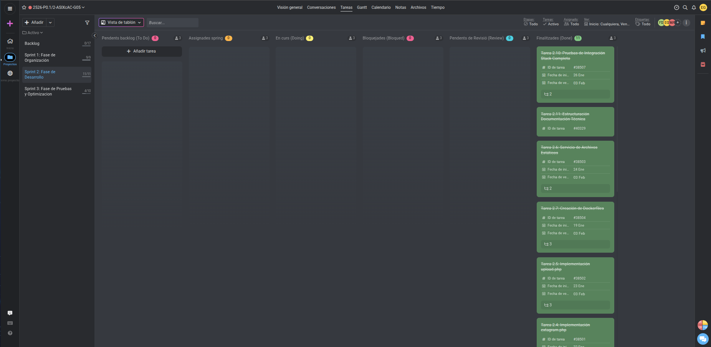

# Acta de Reunión - Sprint Review

## Información del Sprint

**Sprint:**
- Código / Nombre del sprint: Sprint 2 - Fase de Desarrollo
- Fechas del sprint: 19/01/2026 - 03/02/2026

---

**Datos de la Reunión:**
- Fecha: 03/02/2026 15:00
- Reunión: Sprint Review
- Asistentes:
  - Erick García Badaraco
  - Francisco Díaz Encalada
  - Adrià Montero Sánchez

---

## Objetivo del Sprint

| Tema | Notes | Propietario | Estado | Última actualización |
|------|-------|-------------|--------|---------------------|
| **Tarea 2.1:** Instalación Nginx en Máquina Única | Instalar Nginx, crear virtualhost para extagram.itb, validar acceso HTTP básico. | Erick García | **Terminada** | 27/01/2026 |
| **Tarea 2.2:** Instalación PHP-FPM | Instalar PHP-FPM, configurar socket, integración con Nginx para ejecución de scripts PHP. | Erick García | **Terminada** | 27/01/2026 |
| **Tarea 2.3:** Instalación MySQL | Instalar MySQL, crear base de datos extagram_db, usuario extagram_admin, tabla posts. | Francisco Díaz | **Terminada** | 27/01/2026 |
| **Tarea 2.4:** Implementación extagram.php | Desplegar script PHP, adaptar direcciones DNS, validar lectura de posts desde BD. | Erick García | **Terminada** | 02/02/2026 |
| **Tarea 2.5:** Implementación upload.php | Desplegar script upload, crear directorio uploads, validar inserción en BD y almacenamiento archivos. | Erick García | **Terminada** | 02/02/2026 |
| **Tarea 2.6:** Servicio de Archivos Estáticos | Configurar Nginx para servir style.css y preview.svg sin procesamiento PHP. | Erick García | **Terminada** | 02/02/2026 |
| **Tarea 2.7:** Creación de Dockerfiles | Crear Dockerfiles para S1(Nginx), S2-S4(PHP-FPM), S5-S6(Nginx), S7(MySQL). | Francisco Díaz | **Terminada** | 02/02/2026 |
| **Tarea 2.8:** Docker-Compose.yml | Crear archivo que define 7 servicios, redes, volúmenes, variables de entorno. | Francisco Díaz | **Terminada** | 27/01/2026 |
| **Tarea 2.9:** Configuración Proxy Inverso en S1 | Setup Nginx S1: load balancing S2-S3, routing S4-S5-S6. | Erick García | **Terminada** | 27/01/2026 |
| **Tarea 2.10:** Pruebas de Integración Stack Completo | Ejecutar pruebas end-to-end: acceso web, uploads, imágenes, CSS, validar logs. | Adrià Montero | **Terminada** | 02/02/2026 |
| **Tarea 2.11:** Estructuración Documentación Técnica | Estructuración y organización de documentación técnica del proyecto. | Adrià Montero | **Terminada** | 02/02/2026 |

---

## Feedback del Docente

### Mejoras propuesadas:

- Crear un contenedor especifico para 'uploads' y asignarle un volumen especifico.
- Modificar el volumen de la base datos, para que los blob de las imagenes se mantengan alli.

---

### Captura de pantalla del ProofHub:

  

---

## Resumen Ejecutivo

**Progreso general del Sprint 2:** 100% completado (11 de 11 tareas principales terminadas) ✅

### Tareas completadas:

**Tarea 2.1:** Instalación de Nginx en máquina única con virtualhost extagram.itb  
**Tarea 2.2:** Instalación y configuración de PHP-FPM con socket comunicación Nginx-PHP  
**Tarea 2.3:** Instalación de MySQL con BD extagram_db y tabla posts  
**Tarea 2.4:** Despliegue de extagram.php con lectura de posts desde BD  
**Tarea 2.5:** Despliegue de upload.php con almacenamiento persistente de imágenes  
**Tarea 2.6:** Configuración de servicio estático Nginx para CSS y SVG  
**Tarea 2.7:** Creación de Dockerfiles para todos los servicios (S1-S7)  
**Tarea 2.8:** Creación de docker-compose.yml con 7 servicios, redes y volúmenes  
**Tarea 2.9:** Configuración de proxy inverso NGINX con load balancing y routing  
**Tarea 2.10:** Pruebas end-to-end del stack completo validadas  
**Tarea 2.11:** Estructuración de documentación técnica del proyecto  

---

## Hitos Técnicos Alcanzados

### Fase de Instalación Local (Tareas 2.1 - 2.6)
- Stack completo funcional en máquina única
- Integración Nginx + PHP-FPM operativa
- Base de datos MySQL con estructura de tabla posts
- Funcionalidad de lectura (extagram.php) validada
- Funcionalidad de upload (upload.php) con almacenamiento persistente
- Servicio de archivos estáticos configurado

### Fase de Containerización (Tareas 2.7 - 2.8)
- Dockerfiles creados para todos los servicios
- docker-compose.yml con orquestación de 7 contenedores
- Redes Docker configuradas para comunicación entre servicios
- Volúmenes persistentes para datos e imágenes

### Fase de Proxy Inverso (Tarea 2.9)
- NGINX S1 como reverse proxy
- Load balancing entre S2 y S3 (extagram.php)
- Routing a S4 (upload.php)
- Routing a S5 y S6 (archivos estáticos)

### Validación Completa (Tarea 2.10)
- Pruebas E2E del flujo completo
- Verificación de creación de posts
- Validación de uploads y almacenamiento
- Confirmación de visualización de imágenes
- Validación de carga de CSS y SVG

---

## Entregas por Categoría

### Código Fuente
- extagram.php (lectura de posts)
- upload.php (gestión de uploads)
- style.css (estilos de interfaz)
- preview.svg (icono de galería)

### Archivos de Infraestructura
- Dockerfile (S1 NGINX)
- Dockerfile (S2-S4 PHP-FPM)
- Dockerfile (S5-S6 NGINX estáticos)
- Dockerfile (S7 MySQL)
- docker-compose.yml

### Configuración
- nginx.conf (virtualhost extagram.itb)
- nginx.conf (reverse proxy y load balancer)
- php-fpm socket configuration
- MySQL database schema

### Documentación
- Documentación técnica estructurada
- Procedimientos de instalación
- Configuraciones de servicios

---

## Comparativa con Sprint 1

| Aspecto | Sprint 1 | Sprint 2 |
|--------|---------|---------|
| **Duración** | Planificación | Desarrollo |
| **Tareas** | 8 tareas | 11 tareas |
| **Completitud** | 100% | 100% |
| **Entrega** | Documentación | Stack completo + Docker |
| **Complejidad** | Análisis | Implementación |

---

## Próximos Pasos (Sprint 3)

El Sprint 2 ha preparado la base para el Sprint 3 que incluirá:

1. **Instalación de Docker** en las 7 instancias EC2
2. **Despliegue en la nube** de todos los servicios containerizados
3. **Pruebas de escalabilidad** y redundancia
4. **Validación de alta disponibilidad** del sistema
5. **Documentación final** y cierre del proyecto P0.1

---
