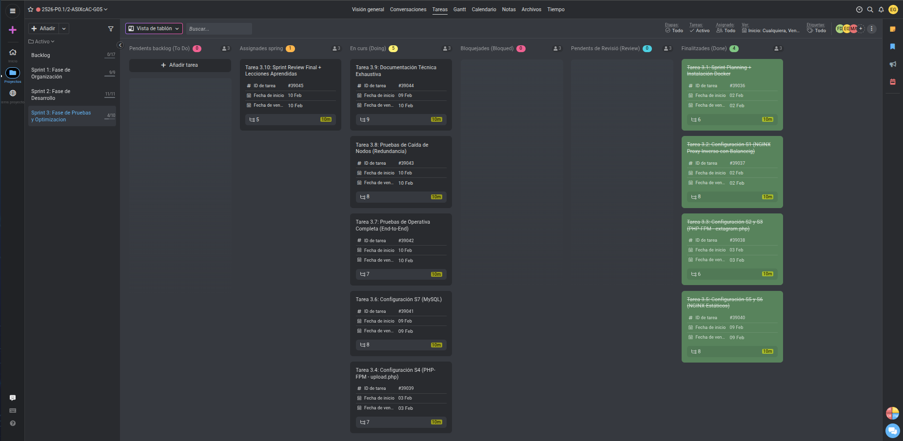

# Acta de Reunión - Sprint Review

## Información del Sprint

**Sprint:**
- Código / Nombre del sprint: Sprint 3 - Fase de Pruebas y Optimización
- Fechas del sprint: 02/02/2026 - 10/02/2026

---

**Datos de la Reunión:**
- Fecha: 03/02/2026 15:00
- Reunión: Sprint Review
- Asistentes:
  - Erick García Badaraco
  - Francisco Díaz Encalada
  - Adrià Montero Sánchez

---

## Objetivo del Sprint

| Tema | Notes | Propietario | Estado | Última actualización |
|------|-------|-------------|--------|---------------------|
| **Tarea 3.1:** Reunión de Sprint Planning + Instalación Docker | Kickoff Sprint 3. Instalar Docker y docker-compose en las 7 instancias EC2 y preparar imágenes base para el despliegue de servicios. | Francisco Díaz Erick García Adrià Montero | **Terminada** | 03/02/2026 |
| **Tarea 3.2:** Configuración S1 (NGINX Proxy Inverso con Balanceo) | Configurar S1 como reverse proxy NGINX que reparte tráfico hacia S2 y S3, enruta a S4 para uploads y a S5/S6 para estáticos, cumpliendo el rol de balanceador y puerta de entrada. | Erick García | **Terminada** | 03/02/2026 |
| **Tarea 3.3:** Configuración S2 y S3 (PHP-FPM - extagram.php) | Configurar las instancias S2 y S3 para ejecutar PHP-FPM con extagram.php, proporcionando redundancia y capacidad de balanceo de carga en la capa de aplicación. | Erick García Adrià Montero | **Terminada** | 03/02/2026 |
| **Tarea 3.4:** Configuración S4 (PHP-FPM - upload.php) | Configurar S4 para ejecutar upload.php con PHP-FPM y gestionar las subidas de imágenes hacia un volumen persistente /uploads accesible por otros servicios. | Francisco Díaz Adrià Montero | **En curso** | 03/02/2026 |
| **Tarea 3.5:** Configuración S5 y S6 (NGINX Estáticos) | Configurar NGINX en S5 para servir imágenes desde /uploads y en S6 para servir ficheros estáticos como CSS y SVG requeridos por Extagram. | Francisco Díaz Erick García | **Terminada** | 03/02/2026 |
| **Tarea 3.6:** Configuración S7 (MySQL) | Configurar S7 con MySQL usando BD extagram_db y usuario extagram_admin, asegurando volumen persistente para datos y acceso controlado desde los servidores de aplicación. | Francisco Díaz Adrià Montero | **En curso** | 03/02/2026 |
| **Tarea 3.7:** Pruebas de Operativa Completa (End-to-End) | Realizar pruebas end-to-end para validar todo el flujo de Extagram desde el navegador hasta la base de datos y el almacenamiento de imágenes. | Francisco Díaz Erick García Adrià Montero | **En curso** | 10/02/2026 |
| **Tarea 3.8:** Pruebas de Caída de Nodos (Redundancia) | Probar el comportamiento del sistema ante caídas de nodos clave (S2, S5, S7) y validar el failover y persistencia de datos. | Francisco Díaz Adrià Montero | **En curso** | 10/02/2026 |
| **Tarea 3.9:** Documentación Técnica Exhaustiva | Crear documentación técnica completa para administrador cubriendo arquitectura, instalación, configuración, troubleshooting, dependencias y procedimientos, cumpliendo criterios RA3. | Francisco Díaz Erick García Adrià Montero | **En curso** | 09/02/2026 |
| **Tarea 3.10:** Sprint Review Final + Lecciones Aprendidas | Realizar la Sprint Review final del Sprint 3, validar cumplimiento de requisitos P0.1 y documentar lecciones aprendidas y roadmap para P0.2. | Francisco Díaz Erick García Adrià Montero | **Asignada** | 10/02/2026 |

---

## Feedback del Docente

### Comentarios positivos:

_[Espacio para comentarios positivos del docente]_

---

### Mejoras propuesadas:

_[Espacio para mejoras propuestas por el docente]_

---

### Captura de pantalla del ProofHub:

  

---

## Acciones Pendientes

- Completar configuración de S4 (upload.php) con volumen persistente
- Finalizar configuración de S7 (MySQL) y validar conectividad desde aplicaciones
- Ejecutar batería completa de pruebas E2E documentando resultados
- Realizar pruebas de redundancia simulando caídas de nodos
- Completar documentación técnica exhaustiva (arquitectura, instalación, troubleshooting)
- Documentar lecciones aprendidas del Sprint 3