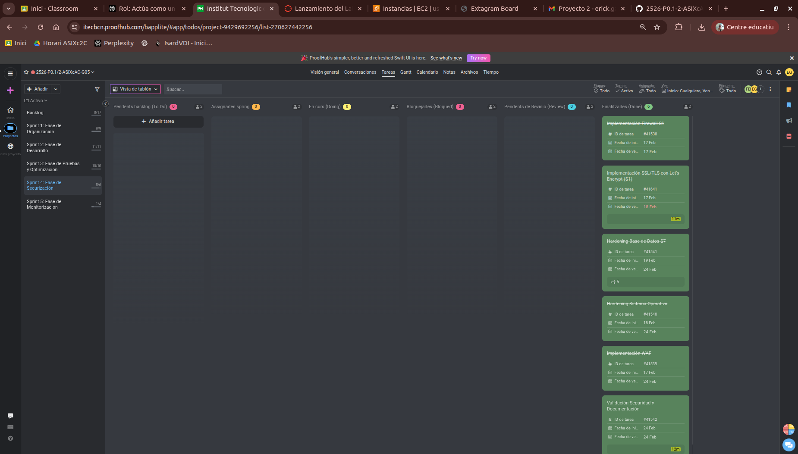

# Acta de Reunión - Sprint Review

## Información del Sprint

**Sprint:**
- Código / Nombre del sprint: Sprint 4 - Fase de Seguridad y Hardening
- Fechas del sprint: 17/02/2026 - 24/02/2026

---

**Datos de la Reunión:**
- Fecha: 24/02/2026 15:00
- Reunión: Sprint Review
- Asistentes:
  - Erick García Badaraco
  - Francisco Díaz Encalada

---

## Objetivo del Sprint

| Tema | Notes | Propietario | Estado | Última actualización |
|------|-------|-------------|--------|---------------------|
| **Tarea 4.1:** Sprint Planning - Kickoff Seguridad | Reunión de inicio del Sprint 4. Revisión de objetivos del P0.2 para la fase de seguridad: firewall ante S1, WAF, hardening de OS y base de datos sobre la infraestructura AWS existente (S1-S7). Creación de acta en `actas/sprint-4-planning.md` con captura ProofHub. | Francisco Díaz Erick García | **Terminada** | 17/02/2026 |
| **Tarea 4.2:** Configurar Firewall AWS ante S1 | Implementación de Security Groups y Network ACLs en AWS para restringir tráfico entrante a S1 (permitir únicamente puertos 80/443 desde internet, denegar el resto). Restricción de tráfico interno entre nodos a puertos estrictamente necesarios (9000, 3306). Validación con nmap desde red externa. | Francisco Díaz Erick García | **Terminada** | 17/02/2026 |
| **Tarea 4.3:** Implementar AWS WAF para Extagram | Configuración de Web Application Firewall asociado a S1 para mitigar ataques SQLi y XSS. Creación de Web ACL con reglas gestionadas de AWS y validación mediante pruebas básicas de inyección sobre los endpoints de Extagram. | Erick García | **Terminada** | 18/02/2026 |
| **Tarea 4.4:** Hardening del Sistema Operativo (S1-S7) | Aplicación de medidas de hardening en todos los nodos Ubuntu/Docker: actualización de paquetes, configuración de UFW restringiendo puertos no esenciales, deshabilitación de login root por SSH y uso exclusivo de autenticación por clave pública. | Francisco Díaz Erick García | **Terminada** | 24/02/2026 |
| **Tarea 4.5:** Hardening MySQL en S7 | Securización de la base de datos MySQL en S7: ejecución de `mysql_secure_installation`, revocación de privilegios de usuario anónimo, eliminación de base de datos de test, bind-address a IP privada y activación de `require_secure_transport`. | Francisco Díaz Erick García | **Terminada** | 24/02/2026 |
| **Tarea 4.6:** Pruebas de Seguridad y Sprint Review | Validación de la operativa web completa post-hardening. Ejecución de pruebas WAF con ataques simulados (SQLi, XSS). Documentación de resultados y lecciones aprendidas. Creación de acta `actas/sprint-4-review.md` y commit final al repositorio. | Francisco Díaz Erick García | **Terminada** | 24/02/2026 |

---

### Captura de pantalla del ProofHub:

  

---

## Acciones Pendientes

- Verificar que todas las reglas de Security Groups y WAF permanecen activas tras el reinicio de instancias
- Revisar logs de WAF en AWS Console para detectar intentos de ataque durante el sprint
- Asegurar que el hardening OS no ha introducido regresiones en la operativa de Extagram (E2E post-hardening)
- Actualizar documentación técnica (`docs/SEGURIDAD.md`) con configuraciones aplicadas en S1-S7
- Realizar commit final con mensaje `sec: Sprint 4 - hardening y WAF completados` al repositorio GitHub
- Preparar entorno para Sprint 5: confirmar nodos S1-S7 operativos antes del 02/03/2026

---

[Indice de Actas](../indice-acta.md)
