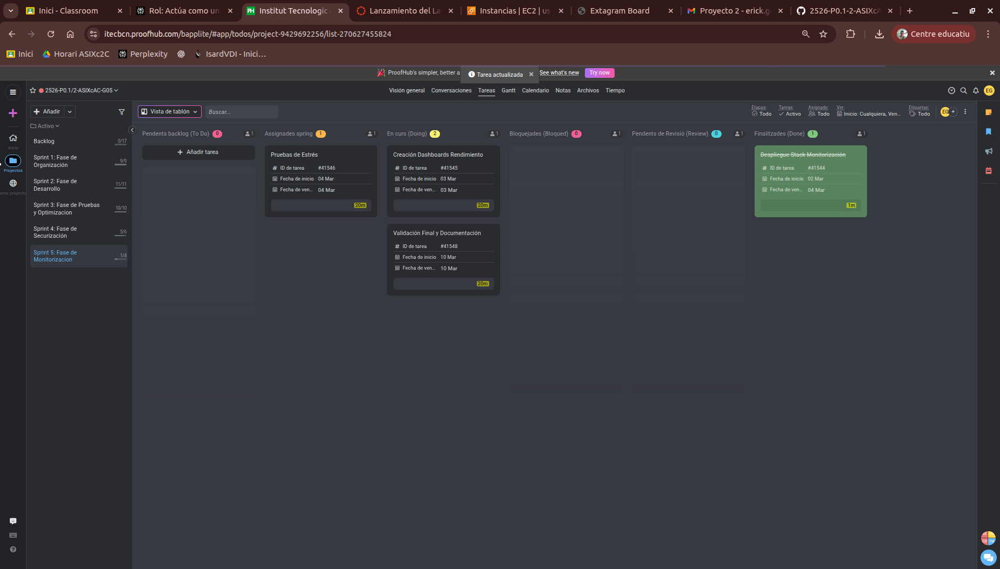

# Acta de Reunión - Sprint Review

## Información del Sprint

**Sprint:**
- Código / Nombre del sprint: Sprint 5 - Fase de Monitorización y Automatización
- Fechas del sprint: 02/03/2026 - 10/03/2026

---

**Datos de la Reunión:**
- Fecha: 03/03/2026 15:00
- Reunión: Sprint Review
- Asistentes:
  - Erick García Badaraco
  - Francisco Díaz Encalada

---

## Objetivo del Sprint

| Tema | Notes | Propietario | Estado | Última actualización |
|------|-------|-------------|--------|---------------------|
| **Tarea 5.1:** Despliegue Stack Monitorización | Implementación del stack ELK (Elasticsearch, Logstash, Kibana) o Grafana + Loki para centralizar logs de todos los nodos S1-S7, cumpliendo el objetivo de monitoratge centralitzat del P0.2. | Francisco Díaz Erick García | **En curso** | 03/03/2026 |
| **Tarea 5.2:** Creación Dashboards de Rendimiento | Configuración de dashboards de métricas clave (CPU, memoria, tráfico NGINX, errores HTTP 4xx/5xx) para visualización del estado de la infraestructura Extagram en tiempo real. | Francisco Díaz Erick García | **En curso** | 03/03/2026 |
| **Tarea 5.3:** Pruebas de Estrés | Simulación de carga sobre los endpoints de Extagram usando Apache Bench o JMeter, analizando rendimiento y comportamiento del balanceador S1 bajo alta concurrencia. | Francisco Díaz Erick García | **Asignada** | 03/03/2026 |
| **Tarea 5.4:** Validación Final y Documentación | Revisión completa del sistema monitorizado, preparación de la demo final y actualización de la documentación técnica para la defensa del proyecto (16-17/03/2026). | Francisco Díaz Erick García | **En curso** | 03/03/2026 |

---

### Captura de pantalla del ProofHub:

  

---

## Acciones Pendientes

- Finalizar despliegue del stack de monitorización (ELK o Grafana) y verificar ingesta de logs desde S1-S7
- Completar y validar los dashboards de rendimiento con métricas reales de la infraestructura
- Ejecutar batería de pruebas de estrés y documentar resultados de rendimiento
- Completar validación final end-to-end del sistema con monitorización activa
- Preparar documentación técnica y evidencias para la defensa del proyecto (16-17/03/2026)
- Realizar commits finales al repositorio GitHub con toda la documentación del P0.2

---

[Indice de Actas](../indice-acta.md)
