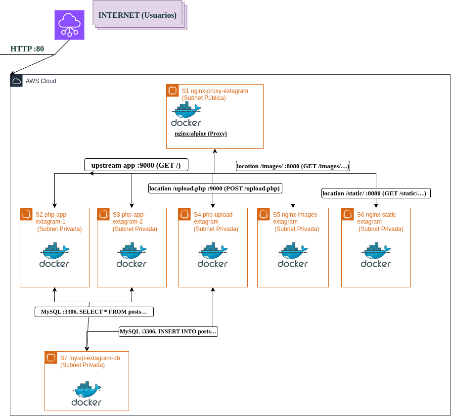

# Topología de Red - Extagram (AWS Multi-Container)

---

## TABLA DE CONTENIDOS

1. [Arquitectura General](#1-arquitectura-general)
2. [Diagrama ASCII Original](#2-diagrama-ascii-original)
3. [Descripción de Cada Servidor](#3-descripción-de-cada-servidor)
4. [Flujos de Datos HTTP](#4-flujos-de-datos-http)

---

## 1. Arquitectura General

**Extagram** es una aplicación web tipo Instagram desplegada en **AWS EC2** con arquitectura **multi-contenedor Docker** y **Docker Compose**. 

### Características Principales:
- **1 instancia pública** (S1) con Nginx proxy exponiendo puerto 80
- **6 instancias privadas** en subred privada (S2-S7)
- **Redundancia** en aplicación PHP (S2+S3)
- **Separación de responsabilidades** (uploads, static, images, DB)
- **Volumen compartido** `/uploads` para persistencia de imágenes
- **Base de datos MySQL** con replicación habilitada


---

## 2. Diagrama de Solucion Propuesta

<div align="center">
  
</div>

---

## 3. Descripción de Cada Servidor

| Servidor | Nombre Descriptivo | Puerto | Función Principal | Contenedor |
|----------|-------------------|--------|-------------------|------------|
| **S1** | `nginx-proxy-extagram` | **80** | **Proxy inverso único punto de entrada** | nginx:alpine |
| **S2** | `php-app-extagram-1` | **9000** | **Aplicación principal (lectura posts)** | php-fpm |
| **S3** | `php-app-extagram-2` | **9000** | **Redundancia app principal** | php-fpm |
| **S4** | `php-upload-extagram` | **9000** | **Procesamiento uploads POST /upload.php** | php-fpm |
| **S5** | `nginx-images-extagram` | **8080** | **Servir imágenes /images/ desde /uploads** | nginx:alpine |
| **S6** | `nginx-static-extagram` | **8080** | **CSS/JS/SVG archivos estáticos /static/** | nginx:alpine |
| **S7** | `mysql-extagram-db` | **3306** | **Base de datos posts (persistencia)** | mysql |

---

## 4. Flujos de Datos HTTP

### 4.1 GET / (Lista de Posts)
```
Cliente → S1:80 (GET /)
     ↓ Nginx resuelve /app/extagram.php
S1 → S2/S3:9000 (upstream app)
     ↓ PHP-FPM ejecuta extagram.php
S2/S3 → S7:3306 (SELECT * FROM posts ORDER BY created_at DESC)
     ↓ PDO devuelve resultset
S2/S3 → S1 (HTML renderizado)
S1 → Cliente (200 OK)
```

### 4.2 POST /upload.php (Nuevo Post)
```
Cliente → S1:80 (POST /upload.php multipart/form-data)
     ↓ Nginx location /upload → S4
S1 → S4:9000 (upload.php)
     ↓ $_FILES['photo'] → /tmp → /uploads/uniqid().jpg
S4 → S7:3306 (INSERT posts(post, photourl))
     ↓ Redirección
S4 → S1 (302 Found Location: /)
S1 → Cliente (302)
```

### 4.3 GET /images/[nombre].jpg (Ver Imagen)
```
Cliente → S1:80 (GET /images/nombre.jpg)
     ↓ Nginx location /images → S5
S1 → S5:8080 (/uploads/nombre.jpg)
     ↓ nginx:alpine lee volumen compartido
S5 → S1 (200 OK image/jpeg, Cache-Control)
S1 → Cliente (imagen)
```

### 4.4 GET /static/style.css (Assets)
```
Cliente → S1:80 (GET /static/style.css)
     ↓ Nginx location /static → S6
S1 → S6:8080 (style.css)
     ↓ Archivo estático servido directamente
S6 → S1 (200 OK text/css)
S1 → Cliente (CSS cacheable)
```

---

[Indice Principal de Arquitectura](./000-indice-arquitectura.md)