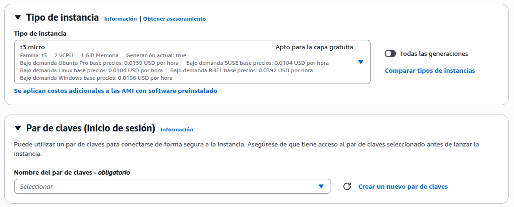
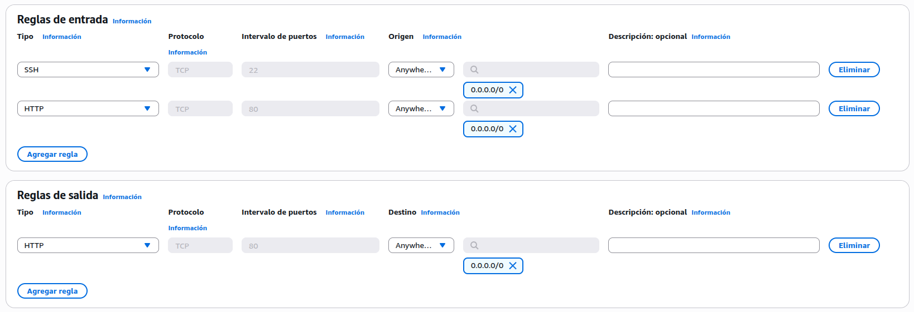
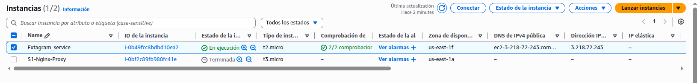
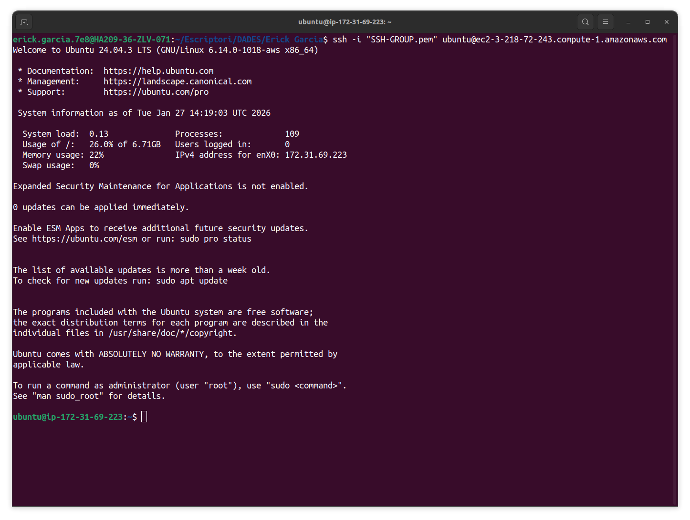

# Manual de Preparacion del Entorno AWS EC2 para Docker

---

## Indice

1. [Marco Teorico](#marco-teorico)
2. [Creacion de Instancia EC2](#creacion-de-instancia-ec2)
3. [Configuracion de Grupo de Seguridad](#configuracion-de-grupo-de-seguridad)
4. [Configuracion Inicial de la Instancia](#configuracion-inicial-de-la-instancia)
5. [Instalacion de Docker y Docker Compose](#instalacion-de-docker-y-docker-compose)

---

# MARCO TEORICO

## 1.1 Conceptos Fundamentales de Cloud Computing

### Infrastructure as a Service (IaaS)

AWS EC2 (Elastic Compute Cloud) es un servicio de IaaS que proporciona instancias de computacion escalables en la nube. Caracteristicas principales:

- Escalabilidad bajo demanda: Agregar o reducir recursos segun necesidad
- Acceso global: Disponible en multiples regiones geograficas
- Pago por uso: Solo pagar por recursos consumidos
- Seguridad integrada: Control de acceso y firewall a nivel de instancia

### Conceptos Clave de EC2

**Instancia**: Servidor virtual que corre el sistema operativo y las aplicaciones.

**Imagen AMI**: Amazon Machine Image. Plantilla que contiene el SO y software preinstalado.

**Tipo de Instancia**: Define los recursos (CPU, memoria, almacenamiento) disponibles.

**Grupo de Seguridad**: Firewall virtual que controla el trafico entrante y saliente.

**Volumen EBS**: Almacenamiento en bloque persistente asociado a una instancia.

**IP Elastica**: Direccion IP publica fija que no cambia al reiniciar.

**Key Pair**: Par de claves (publica/privada) para acceso SSH seguro.

## 1.2 Contenedores y Docker

### Que es un Contenedor

Un contenedor es una unidad estandarizada de software que empaqueta el codigo, las dependencias y la configuracion en un formato aislado y portable.

Caracteristicas:

- Aislamiento de procesos: Cada contenedor ejecuta de forma independiente
- Consistencia: El codigo funciona igual en desarrollo, testing y produccion
- Eficiencia: Comparten el kernel del SO pero tienen sistemas de archivos aislados
- Portabilidad: Funcionan en cualquier sistema que tenga Docker instalado

### Componentes Clave de Docker

**Imagen Docker**: Plantilla inmutable que contiene el codigo, dependencias y configuracion. Se define en un Dockerfile.

**Contenedor**: Instancia ejecutable de una imagen. Es un proceso aislado con su propio sistema de archivos y red.

**Dockerfile**: Archivo de texto que define como construir una imagen Docker paso a paso.

**Docker Compose**: Herramienta para orquestar multiples contenedores. Define servicios, volumenes y redes en un archivo YAML.

**Volumen**: Almacenamiento persistente fuera del contenedor. Permite que los datos persistan cuando el contenedor se elimina.

**Red Bridge**: Permite comunicacion entre contenedores en la misma red Docker.

---

# CREACION DE INSTANCIA EC2

## 2.1 Requisitos Previos

### Cuenta AWS

- Crear cuenta en https://aws.amazon.com si no tienes
- Verificar acceso a Console
- Tener metodo de pago valido

### Configuracion Local

- SSH client instalado (Windows: PuTTY o WSL; Mac/Linux: ssh nativo)
- Navegador web moderno (Chrome, Firefox, Safari, Edge)

## 2.2 Crear Par de Claves (Key Pair)

Antes de crear la instancia, es necesario crear un par de claves para acceso SSH.

### Pasos en Consola AWS

1. Acceder a https://console.aws.amazon.com
2. Navegar a EC2 > Key Pairs (en menu lateral izquierdo)
3. Click en "Create key pair" (boton naranja)
4. Completar informacion:
   - Name: extagram-key (o nombre de tu eleccion)
   - Key pair type: RSA
   - Private key file format: .pem
5. Click en "Create key pair"
6. Se descarga automaticamente el archivo .pem

### Proteger la Clave Privada

Una vez descargada:

En Linux/Mac:
```bash
chmod 400 extagram-key.pem
mv extagram-key.pem ~/.ssh/
```

En Windows (con Git Bash o WSL):
```bash
chmod 400 extagram-key.pem
# Guardar en carpeta segura, ej: C:\Users\tuusuario\.ssh\
```

Importante: No compartir ni perder esta clave. Con ella se accede a todas las instancias.

## 2.3 Lanzar Instancia EC2

### Paso 1: Ir a EC2 Dashboard

1. En consola AWS, buscar "EC2"
2. Click en EC2
3. Click en "Instances" en menu lateral
4. Click en boton "Launch instances" (naranja)

### Paso 2: Seleccionar Imagen (AMI)

En la seccion "Application and OS Images":

Para Amazon Linux 2:
- Buscar "Amazon Linux 2"
- Seleccionar la opcion con "Free tier eligible"
- Click en seleccionar

Para Ubuntu:
- Buscar "Ubuntu 22.04 LTS"
- Seleccionar la version con arquitectura x86 y "Free tier eligible"
- Click en seleccionar

<div align="center">
  
</div>

### Paso 3: Seleccionar Tipo de Instancia

En seccion "Instance type":

Recomendado: t2.small (2GB RAM, 1 vCPU)
- Suficiente para Docker
- Incluido en free tier (primeros 12 meses)

Si necesitas mayor capacidad: t2.medium o superior

<div align="center">
  
</div>

### Paso 4: Configurar Detalles de Instancia

En seccion "Instance details":

- Number of instances: 1
- Network: VPC (default es correcto)
- Subnet: default subnet (dejar como esta)
- Auto-assign public IP: Enable (importante para acceso remoto)
- IAM instance profile: Sin cambios

### Paso 5: Configurar Almacenamiento

En seccion "Storage":

- Size: 30 GiB (minimo recomendado para Docker)
- Volume type: gp3 (general purpose)
- Delete on termination: marcar (para limpiar al eliminar)

### Paso 6: Agregar Tags (Opcional)

En seccion "Tags":

Click en "Add new tag"

- Key: Name
- Value: extagram-instance

Esto facilita identificar la instancia en el dashboard.

### Paso 7: Configurar Grupo de Seguridad

En seccion "Security group":

- Create security group: Seleccionar esta opcion
- Security group name: extagram-sg
- Description: Security group for Extagram

**Agregar reglas de entrada:**

Click en "Add security group rule"

Regla 1 (SSH):
- Type: SSH
- Protocol: TCP
- Port range: 22
- Source: [TU_IP]/32 (o Custom, especificar tu IP)

Regla 2 (HTTP):
- Type: HTTP
- Protocol: TCP
- Port range: 80
- Source: 0.0.0.0/0 (cualquiera)

<div align="center">
  
</div>

### Paso 8: Revisar y Lanzar

1. Click en "Review and launch"
2. Revisar configuracion:
   - AMI correcta
   - Tipo de instancia correcto
   - Almacenamiento 30GB
   - Grupo de seguridad con 3 reglas
3. Click en "Launch" (boton naranja)

### Paso 9: Seleccionar Key Pair

Aparecera ventana "Select key pair":

- Seleccionar "vockey" (de ser necesario crear una previamente)
- Marcar checkbox "I acknowledge..."
- Click en "Launch instances" (naranja)

## 2.4 Obtener Informacion de la Instancia

Una vez lanzada, aparecera mensaje de exito con enlace a instancia.

Click en el enlace o ir a EC2 > Instances.

Anotar la siguiente informacion:

- Instance ID: i-xxxxxxxxxx
- Instance State: running (estado)
- Public IPv4 address: XXX.XXX.XXX.XXX (necesario para SSH)
- Availability Zone: us-east-1a (o similar)

Esperar 2-3 minutos a que la instancia este completamente iniciada.

<div align="center">
  
</div>

---

# CONFIGURACION DE GRUPO DE SEGURIDAD

## 3.1 Referencias de Reglas Comunes

| Servicio | Tipo | Protocolo | Puerto | Fuente Recomendada |
|----------|------|-----------|--------|-------------------|
| SSH | SSH | TCP | 22 | [TU_IP]/32 |
| HTTP | HTTP | TCP | 80 | 0.0.0.0/0 |
| HTTPS | HTTPS | TCP | 443 | 0.0.0.0/0 |
| PostgreSQL | Custom | TCP | 5432 | 0.0.0.0/0 (si es necesario) |
| MySQL | Custom | TCP | 3306 | 0.0.0.0/0 (si es necesario) |
| RDP | RDP | TCP | 3389 | [TU_IP]/32 |

## 3.2 Buenas Practicas de Seguridad

- Nunca abrir puerto 22 (SSH) a 0.0.0.0/0
- Siempre especificar tu IP o rango de IPs conocidas
- Para servicios publicos (HTTP/HTTPS), usar 0.0.0.0/0
- Revisar periodicamente las reglas del grupo
- Eliminar reglas no utilizadas

---

# CONFIGURACION INICIAL DE LA INSTANCIA

## 4.1 Conectar por SSH

Desde terminal (Linux/Mac) o Git Bash/WSL (Windows):

```bash
ssh -i ~/.ssh/extagram-key.pem ec2-user@TU_IP_PUBLICA
```

Cambiar TU_IP_PUBLICA por la direccion IP publica de tu instancia.

Para Ubuntu:
```bash
ssh -i ~/.ssh/extagram-key.pem ubuntu@TU_IP_PUBLICA
```

Si es la primera conexion, aceptar prompt:

```
The authenticity of host 'xxx.xxx.xxx.xxx' can't be established.
Are you sure you want to continue connecting (yes/no/[fingerprint])? yes
```

<div align="center">
  
</div>

Mensaje esperado despues de conectar:

```
Last login: Mon Jan 26 17:00:00 2026 from xxx.xxx.xxx.xxx
[ec2-user@ip-10-0-1-217 ~]$
```

## 4.2 Actualizar Sistema Operativo

Una vez conectado, actualizar todos los paquetes.

Para Amazon Linux 2:

```bash
sudo yum update -y
```

Para Ubuntu:

```bash
sudo apt update
sudo apt upgrade -y
```

Este proceso puede tomar varios minutos. Esperar a que termine.

Verificar actualizacion:

```bash
cat /etc/os-release
```

## 4.3 Instalar Herramientas Basicas

Instalar utilidades necesarias para trabajo con Docker:

Para Amazon Linux 2:

```bash
sudo yum install -y git curl wget vim nano
```

Para Ubuntu:

```bash
sudo apt install -y git curl wget vim nano
```

Estos paquetes incluyen:
- git: Control de versiones
- curl: Descargar archivos desde linea de comandos
- wget: Herramienta de descarga
- vim/nano: Editores de texto

## 4.4 Crear Estructura de Directorios

Crear directorios para proyectos y aplicaciones:

```bash
# Crear directorio base para proyectos
sudo mkdir -p /opt
sudo mkdir -p /opt/docker-projects

# Dar permisos al usuario actual
sudo chown -R $USER:$USER /opt/docker-projects
sudo chmod -R 755 /opt/docker-projects

# Cambiar a directorio de trabajo
cd /opt/docker-projects
pwd
```

Verificar estructura creada:

```bash
ls -la /opt/
```

## 4.5 Verificar Recursos Disponibles

Ver capacidad de la instancia:

Memoria:
```bash
free -h
```

Disco:
```bash
df -h
```

CPUs:
```bash
nproc
```

Informacion completa:
```bash
uname -a
```

Salida esperada (puede variar):

```
              total        used        free      shared  buff/cache   available
Mem:           3.8Gi       402Mi       2.8Gi       0B       582Mi       3.2Gi
Disk /dev/root:    30G        2G        28G       (75% disponible)
```

---

# INSTALACION DE DOCKER Y DOCKER COMPOSE

## 5.1 Instalacion de Docker Engine

### En Amazon Linux 2

```bash
# Instalar Docker
sudo yum install -y docker

# Iniciar servicio Docker
sudo systemctl start docker

# Habilitar inicio automatico en cada reinicio
sudo systemctl enable docker

# Verificar instalacion
docker --version
```

Salida esperada:

```
Docker version 20.10.x, build xxxxx
```

### En Ubuntu 22.04

```bash
# Instalar dependencias previas
sudo apt install -y apt-transport-https ca-certificates curl software-properties-common

# Agregar repositorio oficial de Docker
curl -fsSL https://download.docker.com/linux/ubuntu/gpg | sudo apt-key add -
sudo add-apt-repository "deb [arch=amd64] https://download.docker.com/linux/ubuntu $(lsb_release -cs) stable"

# Actualizar lista de paquetes
sudo apt update

# Instalar Docker
sudo apt install -y docker-ce docker-ce-cli containerd.io

# Iniciar servicio
sudo systemctl start docker

# Habilitar inicio automatico
sudo systemctl enable docker

# Verificar instalacion
docker --version
```

## 5.2 Configurar Permisos de Docker

Por defecto, Docker requiere permisos de root. Configurar para ejecutar sin sudo:

```bash
# Crear grupo docker (si no existe)
sudo groupadd docker

# Agregar usuario actual al grupo
sudo usermod -aG docker $USER

# Activar cambios del grupo
newgrp docker

# Verificar (debe mostrar contenedores activos sin errores)
docker ps
```

Si aparece error "permission denied", desconectar y reconectar SSH:

```bash
exit
# Luego reconectar
ssh -i ~/.ssh/extagram-key.pem ec2-user@TU_IP_PUBLICA
```

## 5.3 Instalar Docker Compose

Descargar e instalar Docker Compose v2 (version mas reciente):

Obtener version mas reciente:

```bash
COMPOSE_VERSION=$(curl -s https://api.github.com/repos/docker/compose/releases/latest | grep 'tag_name' | cut -d'"' -f4)
echo "Instalando Docker Compose $COMPOSE_VERSION"
```

Descargar e instalar:

```bash
# Descargar binario
sudo curl -L "https://github.com/docker/compose/releases/download/$COMPOSE_VERSION/docker-compose-$(uname -s)-$(uname -m)" -o /usr/local/bin/docker-compose

# Dar permisos de ejecucion
sudo chmod +x /usr/local/bin/docker-compose

# Crear enlace simbolico (opcional)
sudo ln -s /usr/local/bin/docker-compose /usr/bin/docker-compose

# Verificar instalacion
docker-compose --version
```

Salida esperada:

```
Docker Compose version v2.20.0, build xxxxx
```

## 5.4 Verificacion de Instalacion

Ejecutar script de diagnostico:

```bash
# Ver version de Docker
docker --version

# Ver informacion de Docker
docker info

# Ver version de Docker Compose
docker-compose --version

# Verificar que puedes ejecutar comandos sin sudo
docker ps

# Test basico de imagen Docker
docker run hello-world
```

Si el comando `docker run hello-world` completa exitosamente, Docker esta correctamente instalado.

Salida esperada:

```
Hello from Docker!
This message shows that your installation appears to be working correctly.
```

## 5.5 Crear Estructura de Trabajo para Docker

Crear directorio para almacenar archivos de Docker:

```bash
# Crear directorio de proyectos
mkdir -p /opt/docker-projects/extagram
cd /opt/docker-projects/extagram

# Crear subdirectorios
mkdir -p config
mkdir -p volumes
mkdir -p scripts
mkdir -p app

# Verificar estructura
tree /opt/docker-projects
# O si no tienes tree:
find /opt/docker-projects -type d
```

Estructura esperada:

```
/opt/docker-projects/
├── extagram/
│   ├── config/
│   ├── volumes/
│   ├── scripts/
│   └── app/
```

## 5.6 Crear Archivo de Configuracion Basico

Crear archivo .bashrc personalizado para variables de entorno de Docker:

```bash
nano ~/.bashrc
```

Agregar al final:

```bash
# Docker Configuration
export DOCKER_PROJECTS="/opt/docker-projects"
export DOCKER_EXTAGRAM="/opt/docker-projects/extagram"

# Aliases utiles
alias docker-ps="docker ps --format 'table {{.Names}}\t{{.Status}}\t{{.Ports}}'"
alias docker-logs="docker-compose logs -f"
alias docker-stats="docker stats --format 'table {{.Container}}\t{{.CPUPerc}}\t{{.MemUsage}}'"
```

Recargar configuracion:

```bash
source ~/.bashrc
```

Verificar:

```bash
echo $DOCKER_PROJECTS
```

---

## Apendice A: Comandos de Diagnostico Rapidos

```bash
# Verificar version de Docker
docker --version

# Ver contenedores en ejecucion
docker ps

# Ver todas las imagenes locales
docker images

# Ver volumenes
docker volume ls

# Ver redes
docker network ls

# Informacion del sistema
df -h              # Espacio en disco
free -h             # Memoria RAM
nproc               # Numero de CPUs
uname -a            # Informacion del kernel

# Logs de Docker daemon
journalctl -u docker
```

## Apendice B: Troubleshooting Basico

### No puedo conectar por SSH

Verificar:
- Grupo de seguridad permite puerto 22
- Tu IP esta en la regla SSH
- Archivo .pem tiene permisos correctos (chmod 400)
- IP publica es correcta

### Docker requiere sudo

Solucionar:
```bash
sudo usermod -aG docker $USER
newgrp docker
```

### Instalacion lenta

Causas comunes:
- Actualizacion del sistema primer arranque
- Conexion a internet lenta
- Muchas imagenes descargandose

Solucion: Esperar 5-10 minutos en primer arranque.

---

Documentacion con fines instructivos